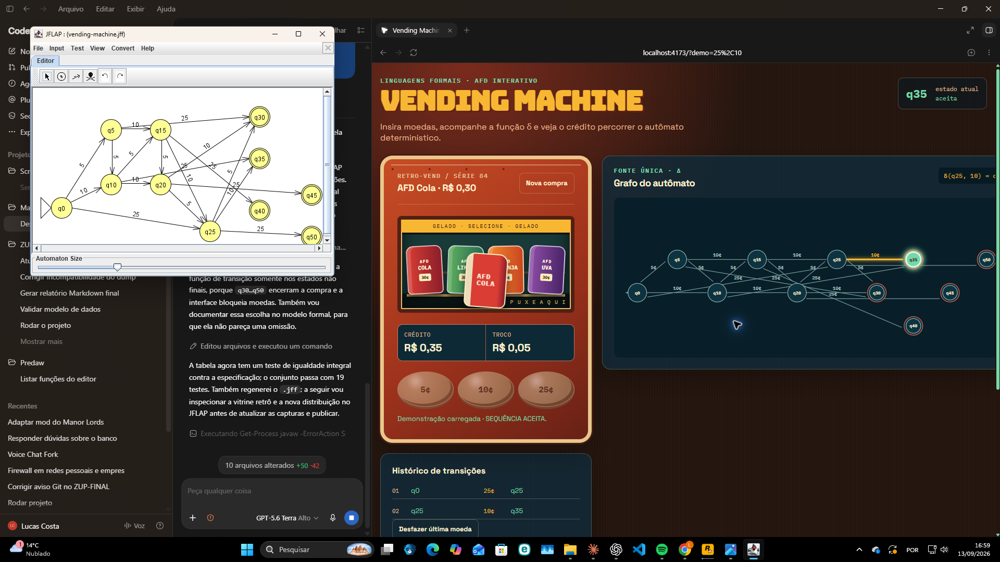
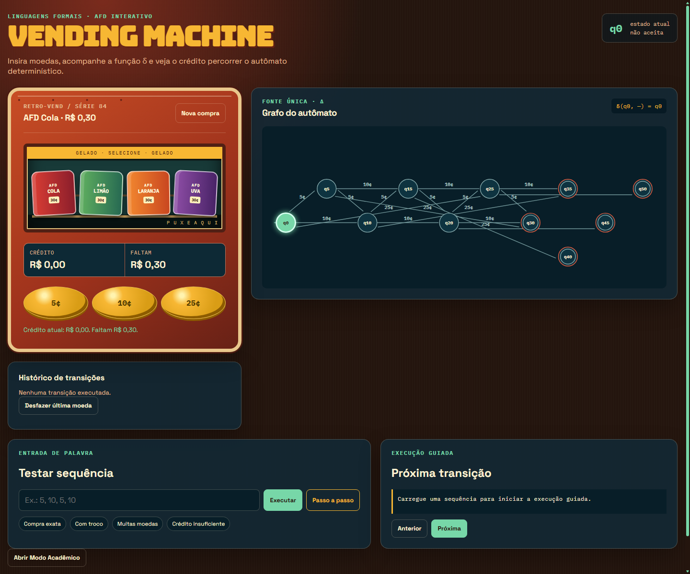
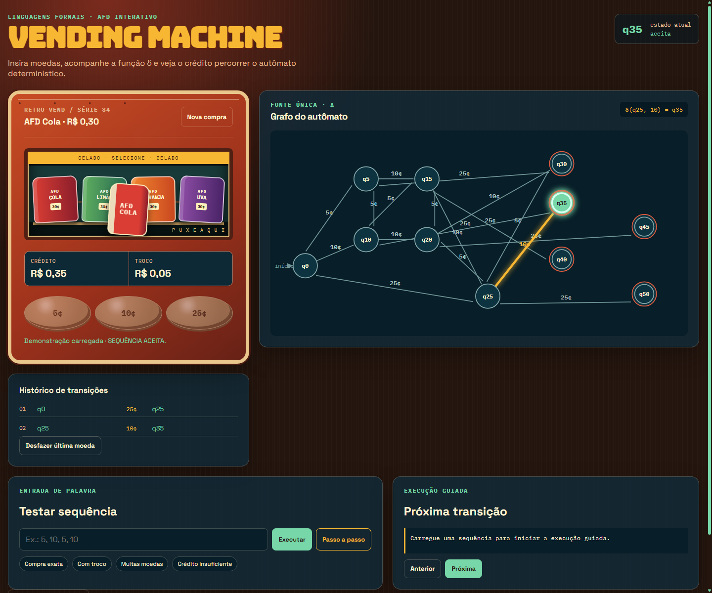

# Vending Machine — Autômato Finito Determinístico

Simulador web de um AFD para uma máquina que vende um produto por **R$ 0,30** e aceita moedas de **5¢, 10¢ e 25¢**.

## Demonstração

A demonstração pública está em [lcsrj.github.io/vending-machine-automato](https://lcsrj.github.io/vending-machine-automato/).

## O modelo formal

`M = (Q, Σ, δ, q0, F)`

- `Q = {q0, q5, q10, q15, q20, q25, q30, q35, q40, q45, q50}`
- `Σ = {5, 10, 25}`
- `q0 = q0`
- `F = {q30, q35, q40, q45, q50}`

Estados finais representam crédito suficiente. O troco é o crédito acumulado menos 30¢.

| Estado | +5¢ | +10¢ | +25¢ |
|---|---|---|---|
| q0 | q5 | q10 | q25 |
| q5 | q10 | q15 | q30 |
| q10 | q15 | q20 | q35 |
| q15 | q20 | q25 | q40 |
| q20 | q25 | q30 | q45 |
| q25 | q30 | q35 | q50 |

Mais detalhes: [modelo formal](docs/modelo-formal.md) e [arquitetura](docs/arquitetura.md).

## Funcionalidades

- Inserção de moedas com função δ e animação no grafo SVG.
- Histórico, troco, bloqueio ao aceitar, desfazer e nova compra.
- Execução integral ou passo a passo de sequências.
- Exemplos: compra exata, compra com troco, muitas moedas e crédito insuficiente.
- Modo Acadêmico com definição formal e tabela de transições ao vivo.
- `.jff` gerado automaticamente da definição central.

## JFLAP

O modelo está em [docs/jflap/vending-machine.jff](docs/jflap/vending-machine.jff). Gere e valide com:

```bash
npm run generate:jflap
npm run check:jflap
```

O arquivo foi aberto no JFLAP 7.1; a captura real da janela, com o título `JFLAP : (vending-machine.jff)`, está em `docs/screenshots/jflap-model.png`.







## Testes e execução local

Requer Node.js 22 ou superior.

```bash
npm test
npm start
```

Abra `http://localhost:4173`. Os testes cobrem transições, entradas inválidas, aceitação, rejeição, troco, bloqueio final, undo e reset.

## Estrutura

```text
src/automaton-definition.js  definição central
src/automaton-engine.js      regras de execução
src/graph.js                 grafo SVG
src/app.js                   integração web
scripts/generate-jflap.mjs   geração do .jff
tests/                        testes automatizados
docs/                         formalização, JFLAP e capturas
```

## CI e GitHub Pages

O workflow em [`.github/workflows/ci.yml`](.github/workflows/ci.yml) executa testes e valida o JFLAP em pushes e pull requests. [`.github/workflows/pages.yml`](.github/workflows/pages.yml) publica a raiz estática no GitHub Pages após push em `master`.

## Autores

Lucas Costa e Silva e Benvindo — projeto de Linguagens Formais e Autômatos.
